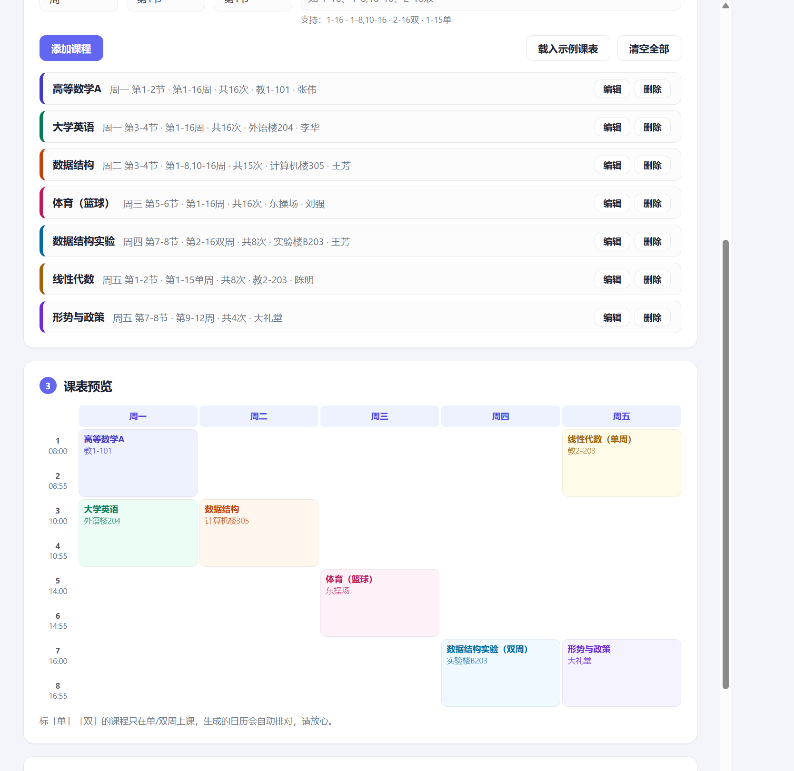

# 课表转日历 kebiao2ics

[](https://github.com/hc-ui/kebiao2ics/actions/workflows/ci.yml)
[](LICENSE)

教务系统不给日历订阅。打开网页，填课表，下载 `.ics`，导入手机日历。

**[在线使用 →](https://hc-ui.github.io/kebiao2ics/)** 免安装，课表不离开你的浏览器。

Works with iPhone / Android / Apple Watch / Outlook / Google Calendar. Nothing is uploaded.



## 为什么做这个

- 教务系统只给你一张网页课表或 Excel，**不提供日历订阅**；
- 课程表 App 要装、要登录、要权限、有广告，毕业就卸载；
- 手机系统日历 + Apple Watch / 桌面小组件明明就够用，缺的只是**一个能把课表塞进去的入口**。

GitHub 上已有的课表转 ics 工具，要么只适配某一所学校的教务系统，要么需要你自己改 Python 代码。`kebiao2ics` 是给**所有学校、不会写代码的同学**用的：打开网页，5 分钟把课表填进去，下载 .ics 导入日历，整学期的课全部各就各位。

## 功能

- **单双周**：`2-16双`、`1-15单` 直接写
- **分段周数**：`1-8,10-16`（第 9 周停课）这类写法直接支持
- **自定义作息时间**：每节课几点上由你定，内置两套常用预设，适配任何学校
- **上课提醒**：每节课提前 5–30 分钟弹通知（可关）
- **课表预览**：填完即所见即所得，颜色区分课程，单双周自动标注
- **时间冲突提醒**：两门课同一天节次重叠、周数又有交集时自动警告（单双周交替不误报），录错立刻能发现
- **节假日调休**：内置「某天停课」和「某天按另一个星期的课表上课」（如 10 月 8 日补周五的课），假期调课不用再去日历里手动挪
- **本地保存**：课表存在浏览器里，关掉网页不丢；支持导出/恢复 JSON 备份，下学期改改继续用
- **稳定事件 ID**：重新生成再导入时，Google / Outlook / Mac 日历会自动覆盖旧日程而不是产生重复（iPhone 建议导入到单独日历，便于整体替换）
- **隐私**：纯静态页面，无后端、无统计、无 Cookie，课表数据不离开你的设备

## 使用步骤

1. 打开 [hc-ui.github.io/kebiao2ics](https://hc-ui.github.io/kebiao2ics/)
2. 设置**第一周周一**的日期（开学那周的周一）
3. 需要的话在「作息时间表」里改成你学校的上课时间
4. 逐门添加课程（星期、节次、周数、地点）
5. 点「生成并下载 .ics」
6. 按页面里的教程导入 iPhone / 安卓 / 电脑日历

### 周数写法速查

| 写法 | 含义 |
|------|------|
| `1-16` | 第 1 到 16 周 |
| `1-8,10-16` | 跳过第 9 周 |
| `2-16双` | 双周 |
| `1-15单` | 单周 |
| `3,5,9` | 只有这几周 |
| `第1-16周` | 「第 / 周」字样与空格会被自动忽略 |

## 常见问题

**节假日调课怎么办？** 在「节假日调休」里直接配置：放假日选「当天停课」，补课日选「按周几的课上」，重新生成即可。个别单节课的临时变动也可以在手机日历里手动删改（Google / Outlook / Mac 日历重新导入时按事件 ID 自动覆盖；iPhone 建议先删旧日历再导入）。

**为什么不做成订阅链接（webcal）？** 订阅链接需要服务器存你的课表。本工具选择纯本地方案：没有账号、没有服务器、没有隐私问题，代价是调课后需要重新导入一次。

**支持从教务系统自动导入吗？** 各校教务系统格式千差万别，暂不支持自动抓取。欢迎在 [issue](https://github.com/hc-ui/kebiao2ics/issues) 里告诉我你学校的课表格式（截图或复制文本），呼声高的会优先支持。

## 本地开发

纯原生 HTML/CSS/JS，无构建步骤：

```bash
git clone https://github.com/hc-ui/kebiao2ics.git
cd kebiao2ics
python -m http.server 8000   # 或任何静态服务器
# 打开 http://localhost:8000
```

核心逻辑（周数解析、ics 生成）在 `ics.js`，跑测试：

```bash
node --test tests/core.test.mjs
```

## English

A zero-install, browser-only tool that converts Chinese university class schedules into `.ics` calendar files.

- Handles the quirks of Chinese timetables: odd/even weeks (单双周), split week ranges (`1-8,10-16`), numbered class periods with per-school time tables
- Detects time conflicts between courses (same day, overlapping periods, intersecting weeks — alternating odd/even weeks don't false-positive)
- Built-in holiday rescheduling: mark a date as "no classes" or "follows another weekday's timetable", which is how Chinese universities handle holiday make-up days
- Per-class reminders via `VALARM`; stable UIDs so re-imports update instead of duplicating
- Fully client-side: no backend, no tracking, your schedule never leaves the device
- Core logic (`ics.js`) is a dependency-free ES module with a `node --test` suite; RFC 5545 compliant output (proper escaping, 75-octet line folding, `Asia/Shanghai` VTIMEZONE)

## License

[MIT](LICENSE)
